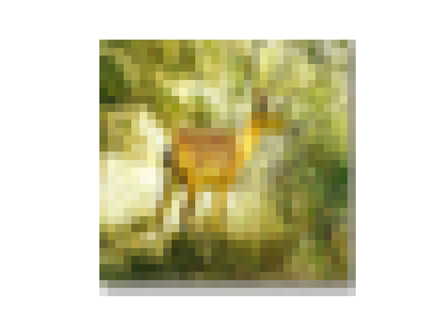

# CIFAR-10

El objetivo de este proyecto será crear una red neuronal capaz de identificar elementos en imágenes. El dataset a utilizar será `keras.datasets.cifar10`. Dicho dataset contiene registros de imágenes clasificadas en 10 categorías que revisaremos en la fase de preprocesamiento.

La arquitectura a utilizar será un `MLP`.

Se utilizarán estrategias avanzadas de `hypertunning`, regularización (`l2` y `dropout`), etc.


## Preprocesamiento

En las primeras observaciones encontramos los siguiente:

```
    Shape del X_train: (50000, 32, 32, 3)
    Shape del Y_train : (50000, 1)
    
    Shape del X_test : (10000, 32, 32, 3)
    Shape del Y_test : (10000, 1)

```

Las imagenes son matrices de `32 x 32 x 3`. En el conjunto de entrenamiento contamos con 50.000 imagenes y sus respectivos targets.

En el conjunto de test contamos con 10.000 imagenes, y tambien, sus respectivos targets.

Cada matriz tiene el siguiente formato:

```
[[[249 248 246]
  [240 240 226]
  [239 241 218]
  ...
  [238 246 223]
  [239 246 230]
  [251 254 252]]

 [[226 229 216]
  [151 156 129]
  [142 150 109]
  ...
  [159 172 129]
  [182 191 163]
  [243 248 239]]

 [[216 223 202]
  [118 128  87]
  [108 119  61]
  ...
  [107 122  64]
  [146 157 118]
  [240 246 230]]

 ...

 [[219 223 198]
  [115 121  82]
  [101 110  60]
  ...
  [  0   0   0]
  [ 57  57  56]
  [237 237 236]]

 [[224 227 205]
  [134 139 107]
  [110 117  75]
  ...
  [ 21  20  20]
  [ 79  79  79]
  [235 235 235]]

 [[244 245 235]
  [224 227 208]
  [216 220 196]
  ...
  [194 192 192]
  [205 205 205]
  [249 249 249]]]

```

La **representacion raw** de cada imagen es una matriz de `32 x 32 x 3` donde cada celda contiene un valor entre 0 y 255 que representa el valor par ese canal (RGB).

En el caso de los targets:

```
Distribucion de targets para Y_train

6    5000
9    5000
4    5000
1    5000
2    5000
7    5000
8    5000
3    5000
5    5000
0    5000
Name: count, dtype: int64

Distribucion de targets para Y_test

3    1000
8    1000
0    1000
6    1000
1    1000
9    1000
5    1000
7    1000
4    1000
2    1000
Name: count, dtype: int64

```

Como podemos ver, el conjunto esta completamente equilibrado.

En cuanto a las imagenes, se ven asi:



Como vemos, son muy pequenias (lo cual tiene sentido por que la resolucion es de `32 x 32`).

Cabe mencionar el mapa de targets:

```
0	airplane
1	automobile
2	bird
3	cat
4	deer
5	dog
6	frog
7	horse
8	ship
9	truck
```

### Aplanamiento de targets

Por alguna razon, al cargar el dataset inicialmente, los targets vienen con el siguiente formato:

```
Y_train : [ [x], [y], [z] ...]
```

Usando el metodo `.flatten()` de numpy, los convertimos al siguiente formato:

```
Y_train : [x, y, z, ...]
```

Codigo:

```
from tensorflow import keras
from sklearn.model_selection import train_test_split

(X_train, Y_train), (X_test, Y_test) = keras.datasets.cifar10.load_data()
print(f"""
Forma inicial de Y_train: {Y_train}
Forma inicial de Y_test: {Y_test}

""")
Y_train = Y_train.flatten()
Y_test = Y_test.flatten()

print(f"""
Forma final de Y_train: {Y_train}
Forma final de Y_test: {Y_test}
""")

```

Resultado:

```
Forma inicial de Y_train: [[6]
 [9]
 [9]
 ...
 [9]
 [1]
 [1]]
Forma inicial de Y_test: [[3]
 [8]
 [8]
 ...
 [5]
 [1]
 [7]]


Forma final de Y_train: [6 9 9 ... 9 1 1]
Forma final de Y_test: [3 8 8 ... 5 1 7]

```

### Division de conjunto de datos

Se dividio el conjunto de `test` en `val-test`.

Usando el siguiente codigo:

```
from tensorflow import keras
from sklearn.model_selection import train_test_split

# carga del dataset
(X_train, Y_train), (X_test, Y_test) = keras.datasets.cifar10.load_data()

# aplanamiento de targets
Y_train = Y_train.flatten()
Y_test = Y_test.flatten()

# division del conjunto de datos
X_val, X_test, Y_val, Y_test = train_test_split(X_test, Y_test, random_state=42, stratify=Y_test, test_size=.5)


print(f"""

    Shape del X_val : {X_val.shape}
    Shape del Y_val : {Y_val.shape}

    Shape del X_test : {X_test.shape}
    Shape del Y_test : {Y_test.shape}
""")


```

Obtuvimos los siguientes resultados:

```
    Shape del X_val : (5000, 32, 32, 3)
    Shape del Y_val : (5000,)

    Shape del X_test : (5000, 32, 32, 3)
    Shape del Y_test : (5000,)

```

## Entrenamiento

## Evaluación

