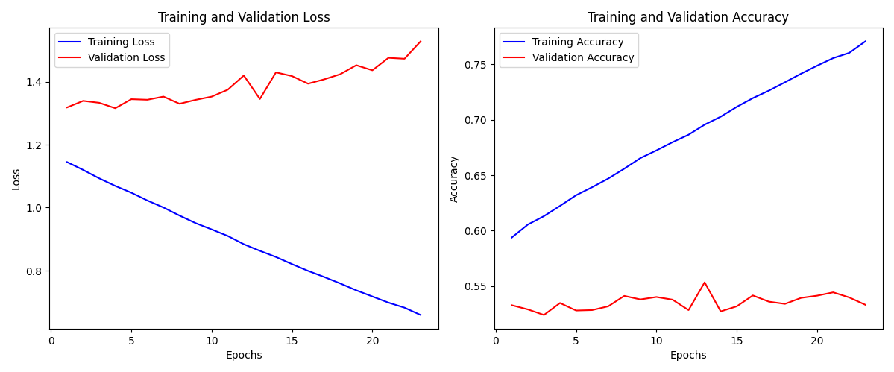
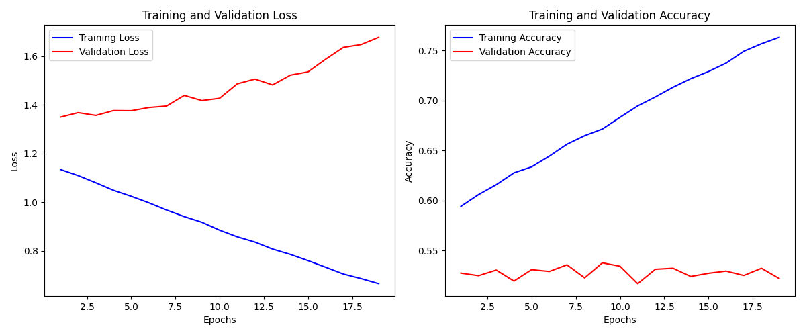

# CIFAR-10

El objetivo de este proyecto será crear una red neuronal capaz de identificar elementos en imágenes. El dataset a utilizar será `keras.datasets.cifar10`. Dicho dataset contiene registros de imágenes clasificadas en 10 categorías que revisaremos en la fase de preprocesamiento.

La arquitectura a utilizar será un `MLP`.

Se utilizarán estrategias avanzadas de `hypertunning`, regularización (`l2` y `dropout`), etc.


## Preprocesamiento

En las primeras observaciones encontramos los siguiente:

```
    Shape del X_train: (50000, 32, 32, 3)
    Shape del Y_train : (50000, 1)
    
    Shape del X_test : (10000, 32, 32, 3)
    Shape del Y_test : (10000, 1)

```

Las imagenes son matrices de `32 x 32 x 3`. En el conjunto de entrenamiento contamos con 50.000 imagenes y sus respectivos targets.

En el conjunto de test contamos con 10.000 imagenes, y tambien, sus respectivos targets.

Cada matriz tiene el siguiente formato:

```
[[[249 248 246]
  [240 240 226]
  [239 241 218]
  ...
  [238 246 223]
  [239 246 230]
  [251 254 252]]

 [[226 229 216]
  [151 156 129]
  [142 150 109]
  ...
  [159 172 129]
  [182 191 163]
  [243 248 239]]

 [[216 223 202]
  [118 128  87]
  [108 119  61]
  ...
  [107 122  64]
  [146 157 118]
  [240 246 230]]

 ...

 [[219 223 198]
  [115 121  82]
  [101 110  60]
  ...
  [  0   0   0]
  [ 57  57  56]
  [237 237 236]]

 [[224 227 205]
  [134 139 107]
  [110 117  75]
  ...
  [ 21  20  20]
  [ 79  79  79]
  [235 235 235]]

 [[244 245 235]
  [224 227 208]
  [216 220 196]
  ...
  [194 192 192]
  [205 205 205]
  [249 249 249]]]

```

La **representacion raw** de cada imagen es una matriz de `32 x 32 x 3` donde cada celda contiene un valor entre 0 y 255 que representa el valor par ese canal (RGB).

En el caso de los targets:

```
Distribucion de targets para Y_train

6    5000
9    5000
4    5000
1    5000
2    5000
7    5000
8    5000
3    5000
5    5000
0    5000
Name: count, dtype: int64

Distribucion de targets para Y_test

3    1000
8    1000
0    1000
6    1000
1    1000
9    1000
5    1000
7    1000
4    1000
2    1000
Name: count, dtype: int64

```

Como podemos ver, el conjunto esta completamente equilibrado.

En cuanto a las imagenes, se ven asi:


Como vemos, son muy pequenias (lo cual tiene sentido por que la resolucion es de `32 x 32`).

Cabe mencionar el mapa de targets:

```
0	airplane
1	automobile
2	bird
3	cat
4	deer
5	dog
6	frog
7	horse
8	ship
9	truck
```

### Aplanamiento de targets

Por alguna razon, al cargar el dataset inicialmente, los targets vienen con el siguiente formato:

```
Y_train : [ [x], [y], [z] ...]
```

Usando el metodo `.flatten()` de numpy, los convertimos al siguiente formato:

```
Y_train : [x, y, z, ...]
```

Codigo:

```
from tensorflow import keras
from sklearn.model_selection import train_test_split

(X_train, Y_train), (X_test, Y_test) = keras.datasets.cifar10.load_data()
print(f"""
Forma inicial de Y_train: {Y_train}
Forma inicial de Y_test: {Y_test}

""")
Y_train = Y_train.flatten()
Y_test = Y_test.flatten()

print(f"""
Forma final de Y_train: {Y_train}
Forma final de Y_test: {Y_test}
""")

```

Resultado:

```
Forma inicial de Y_train: [[6]
 [9]
 [9]
 ...
 [9]
 [1]
 [1]]
Forma inicial de Y_test: [[3]
 [8]
 [8]
 ...
 [5]
 [1]
 [7]]


Forma final de Y_train: [6 9 9 ... 9 1 1]
Forma final de Y_test: [3 8 8 ... 5 1 7]

```

### Division de conjunto de datos

Se dividio el conjunto de `test` en `val-test`.

Usando el siguiente codigo:

```
from tensorflow import keras
from sklearn.model_selection import train_test_split

# carga del dataset
(X_train, Y_train), (X_test, Y_test) = keras.datasets.cifar10.load_data()

# aplanamiento de targets
Y_train = Y_train.flatten()
Y_test = Y_test.flatten()

# division del conjunto de datos
X_val, X_test, Y_val, Y_test = train_test_split(X_test, Y_test, random_state=42, stratify=Y_test, test_size=.5)


print(f"""

    Shape del X_val : {X_val.shape}
    Shape del Y_val : {Y_val.shape}

    Shape del X_test : {X_test.shape}
    Shape del Y_test : {Y_test.shape}
""")


```

Obtuvimos los siguientes resultados:

```
    Shape del X_val : (5000, 32, 32, 3)
    Shape del Y_val : (5000,)

    Shape del X_test : (5000, 32, 32, 3)
    Shape del Y_test : (5000,)

```

### Normalizacion

La idea de la normalizacion es hacer que todas las caracteristicas del vector de entrada (los pixeles), esten en el mismo rango de valores para no introducir sesgos en el modelo dada la escala de las caracteristicas.

Para ello utilizamos el siguiente codigo:

```
from tensorflow import keras
from sklearn.model_selection import train_test_split

# carga del dataset
(X_train, Y_train), (X_test, Y_test) = keras.datasets.cifar10.load_data()

# aplanamiento de targets
Y_train = Y_train.flatten()
Y_test = Y_test.flatten()

# division del conjunto de datos
X_val, X_test, Y_val, Y_test = train_test_split(X_test, Y_test, random_state=42, stratify=Y_test, test_size=.5)

# normalizacion
print("Valor del registro 100 antes de normalizacion ")
print(X_train[100])

X_train = X_train.astype("float32") / 255.0

print("Valor del registro 100 despues de normalizacion ")
print(X_train[100])

X_test = X_test.astype("float32") / 255.0
X_val = X_val.astype("float32") / 255.0

```

Como sabemos que todos los pixeles tienen valores entre 0 y 255, al dividir entre 255 nos aseguramos de que todos los pixeles tengan valores entre 0 y 1.

Obtuvimos los siguientes resultados:

```

Valor del registro 100 antes de normalizacion 

[[[213 229 242]
  [211 227 240]
  [211 227 240]
  ...
  [151 174 206]
  [151 174 206]
  [149 172 204]]

 [[214 229 241]
  [212 227 239]
  [212 227 239]
  ...
  [152 175 207]
  [152 175 207]
  [151 174 205]]

 [[216 229 239]
  [214 227 237]
  [213 227 237]
  ...
  [153 176 206]
  [153 176 206]
  [151 174 204]]

 ...

 [[145 159 165]
  [136 148 154]
  [143 152 158]
  ...
  [216 217 206]
  [196 197 191]
  [183 183 182]]

 [[139 153 159]
  [129 142 148]
  [129 139 145]
  ...
  [227 228 219]
  [223 224 219]
  [209 209 209]]

 [[137 152 157]
  [143 155 161]
  [136 145 152]
  ...
  [209 209 203]
  [217 217 213]
  [228 228 226]]]

Valor del registro 100 despues de normalizacion 

[[[0.8352941  0.8980392  0.9490196 ]
  [0.827451   0.8901961  0.9411765 ]
  [0.827451   0.8901961  0.9411765 ]
  ...
  [0.5921569  0.68235296 0.80784315]
  [0.5921569  0.68235296 0.80784315]
  [0.58431375 0.6745098  0.8       ]]

 [[0.8392157  0.8980392  0.94509804]
  [0.83137256 0.8901961  0.9372549 ]
  [0.83137256 0.8901961  0.9372549 ]
  ...
  [0.59607846 0.6862745  0.8117647 ]
  [0.59607846 0.6862745  0.8117647 ]
  [0.5921569  0.68235296 0.8039216 ]]

 [[0.84705883 0.8980392  0.9372549 ]
  [0.8392157  0.8901961  0.92941177]
  [0.8352941  0.8901961  0.92941177]
  ...
  [0.6        0.6901961  0.80784315]
  [0.6        0.6901961  0.80784315]
  [0.5921569  0.68235296 0.8       ]]

 ...

 [[0.5686275  0.62352943 0.64705884]
  [0.53333336 0.5803922  0.6039216 ]
  [0.56078434 0.59607846 0.61960787]
  ...
  [0.84705883 0.8509804  0.80784315]
  [0.76862746 0.77254903 0.7490196 ]
  [0.7176471  0.7176471  0.7137255 ]]

 [[0.54509807 0.6        0.62352943]
  [0.5058824  0.5568628  0.5803922 ]
  [0.5058824  0.54509807 0.5686275 ]
  ...
  [0.8901961  0.89411765 0.85882354]
  [0.8745098  0.8784314  0.85882354]
  [0.81960785 0.81960785 0.81960785]]

 [[0.5372549  0.59607846 0.6156863 ]
  [0.56078434 0.60784316 0.6313726 ]
  [0.53333336 0.5686275  0.59607846]
  ...
  [0.81960785 0.81960785 0.79607844]
  [0.8509804  0.8509804  0.8352941 ]
  [0.89411765 0.89411765 0.8862745 ]]]
```

La eleccion de usar `float32` en lugar de `float64` viene dada por las siguientes razones:

1- `float32` ocupa la mitad de la memoria
2- `float32` tiene capacidad para 8 digitos de precision, mas que suficiente
3- Librerias como tensorflow estan optimizadas para hacer calculos con `float32`

Forma final del `main.py`

```
from tensorflow import keras
from sklearn.model_selection import train_test_split

# carga del dataset
(X_train, Y_train), (X_test, Y_test) = keras.datasets.cifar10.load_data()

# aplanamiento de targets
Y_train = Y_train.flatten()
Y_test = Y_test.flatten()

# division del conjunto de datos
X_val, X_test, Y_val, Y_test = train_test_split(X_test, Y_test, random_state=42, stratify=Y_test, test_size=.5)

# normalizacion

X_train = X_train.astype("float32") / 255.0
X_test = X_test.astype("float32") / 255.0
X_val = X_val.astype("float32") / 255.0

```

## Entrenamiento

### Primer intento de entrenamiento

Utilizando el siguiente codigo:

```

# utils/model_builder.py

from tensorflow import keras
from keras import layers

def model_builder(hp):
    model = keras.Sequential()
    n_hidden_layers = hp.Int('n_hidden_layers', min_value=1, max_value=3, step=1)
    learning_rate = hp.Choice('learning_rate', values=[1e-2, 1e-3, 1e-4, 1e-5])

    model.add(layers.Flatten(input_shape=(32,32,3)))

    for i in range(n_hidden_layers):
        n_units = hp.Int(f'layer_{i}_units', min_value=24, max_value=480, step=24)
        #drop_rate = hp.Float(f'layer_{i}_drop', min_value=0.1, max_value=0.35, step=0.05)
        #regu_cons = hp.Choice(f'layer_{i}_regu_cons', values=[1e-2, 1e-3, 1e-4, 1e-5])


        model.add(layers.Dense(
            units=n_units,
            activation="relu",
            #kernel_regularizer=keras.regularizers.l2(regu_cons)
        ))
        #model.add(layers.Dropout(rate=drop_rate))

    model.add(layers.Dense(units=10, activation="softmax"))

    model.compile(
        optimizer=keras.optimizers.Adam(learning_rate=learning_rate),
        loss="sparse_categorical_crossentropy",
        metrics=['accuracy']
    )
    return model

# main.py 


from keras.src.backend.config import max_epochs
from tensorflow import keras
from sklearn.model_selection import train_test_split
import keras_tuner as kt
from utils.model_builder import model_builder
from utils.show_train_results import show_train_results

# carga del dataset
(X_train, Y_train), (X_test, Y_test) = keras.datasets.cifar10.load_data()

# aplanamiento de targets
Y_train = Y_train.flatten()
Y_test = Y_test.flatten()

# division del conjunto de datos
X_val, X_test, Y_val, Y_test = train_test_split(X_test, Y_test, random_state=42, stratify=Y_test, test_size=.5)

# normalizacion

X_train = X_train.astype("float32") / 255.0
X_test = X_test.astype("float32") / 255.0
X_val = X_val.astype("float32") / 255.0

# entrenamiento

tuner = kt.Hyperband(
    model_builder,
    objective='val_accuracy',
    factor=2,
    max_epochs=15,
    project_name="CIFAR-10",
    directory="train_results"
)

tuner.search(
    X_train,
    Y_train,
    validation_data=(X_val, Y_val),
)


# Mejor modelo encontrado
best_model = tuner.get_best_models(num_models=1)[0]

# Resumen de los mejores hiperparámetros
best_hps = tuner.get_best_hyperparameters(num_trials=1)[0]


print(f"""
    Mejor combinacion de hiperparametros

        {best_hps.values}
""")


early_stopping = keras.callbacks.EarlyStopping(
    monitor='val_accuracy',   # Métrica a monitorear (puede ser 'val_accuracy')
    patience=10,          # Número de épocas sin mejora antes de detener
    restore_best_weights=True , # Restaura los pesos del mejor modelo
    mode="max",
    verbose=2
)


history = best_model.fit(
    X_train, Y_train,
    epochs=30,
    validation_data=(X_val, Y_val),
    callbacks=[early_stopping]
)

test_loss, test_accuracy = best_model.evaluate(X_test, Y_test)
print(f"""

    Rendimiento del modelo para test

    Loss: {test_loss}
    Accuracy: {test_accuracy}
""")

show_train_results(history)

```

Obtuvimos los siguientes resultados:


```

    Mejor combinacion de hiperparametros

        {'n_hidden_layers': 3, 'learning_rate': 0.0001, 'layer_0_units': 432, 'layer_1_units': 288, 'layer_2_units': 312, 'tuner/epochs': 15, 'tuner/initial_epoch': 8, 'tuner/bracket': 3, 'tuner/round': 3, 'tuner/trial_id': '0015'}

Epoch 1/30
1563/1563 ━━━━━━━━━━━━━━━━━━━━ 21s 13ms/step - accuracy: 0.5981 - loss: 1.1384 - val_accuracy: 0.5328 - val_loss: 1.3181
Epoch 2/30
1563/1563 ━━━━━━━━━━━━━━━━━━━━ 20s 13ms/step - accuracy: 0.6067 - loss: 1.1176 - val_accuracy: 0.5290 - val_loss: 1.3389
Epoch 3/30
1563/1563 ━━━━━━━━━━━━━━━━━━━━ 20s 13ms/step - accuracy: 0.6173 - loss: 1.0859 - val_accuracy: 0.5240 - val_loss: 1.3328
Epoch 4/30
1563/1563 ━━━━━━━━━━━━━━━━━━━━ 20s 13ms/step - accuracy: 0.6242 - loss: 1.0665 - val_accuracy: 0.5348 - val_loss: 1.3156
Epoch 5/30
1563/1563 ━━━━━━━━━━━━━━━━━━━━ 20s 13ms/step - accuracy: 0.6365 - loss: 1.0429 - val_accuracy: 0.5280 - val_loss: 1.3443
Epoch 6/30
1563/1563 ━━━━━━━━━━━━━━━━━━━━ 20s 13ms/step - accuracy: 0.6447 - loss: 1.0101 - val_accuracy: 0.5284 - val_loss: 1.3425
Epoch 7/30
1563/1563 ━━━━━━━━━━━━━━━━━━━━ 20s 13ms/step - accuracy: 0.6520 - loss: 0.9906 - val_accuracy: 0.5318 - val_loss: 1.3526
Epoch 8/30
1563/1563 ━━━━━━━━━━━━━━━━━━━━ 20s 13ms/step - accuracy: 0.6605 - loss: 0.9687 - val_accuracy: 0.5412 - val_loss: 1.3297
Epoch 9/30
1563/1563 ━━━━━━━━━━━━━━━━━━━━ 20s 13ms/step - accuracy: 0.6689 - loss: 0.9359 - val_accuracy: 0.5380 - val_loss: 1.3422
Epoch 10/30
1563/1563 ━━━━━━━━━━━━━━━━━━━━ 20s 13ms/step - accuracy: 0.6736 - loss: 0.9234 - val_accuracy: 0.5402 - val_loss: 1.3525
Epoch 11/30
1563/1563 ━━━━━━━━━━━━━━━━━━━━ 20s 13ms/step - accuracy: 0.6846 - loss: 0.8998 - val_accuracy: 0.5378 - val_loss: 1.3744
Epoch 12/30
1563/1563 ━━━━━━━━━━━━━━━━━━━━ 20s 13ms/step - accuracy: 0.6900 - loss: 0.8791 - val_accuracy: 0.5284 - val_loss: 1.4196
Epoch 13/30
1563/1563 ━━━━━━━━━━━━━━━━━━━━ 20s 13ms/step - accuracy: 0.6996 - loss: 0.8566 - val_accuracy: 0.5534 - val_loss: 1.3450
Epoch 14/30
1563/1563 ━━━━━━━━━━━━━━━━━━━━ 20s 13ms/step - accuracy: 0.7106 - loss: 0.8295 - val_accuracy: 0.5272 - val_loss: 1.4295
Epoch 15/30
1563/1563 ━━━━━━━━━━━━━━━━━━━━ 20s 13ms/step - accuracy: 0.7135 - loss: 0.8119 - val_accuracy: 0.5318 - val_loss: 1.4176
Epoch 16/30
1563/1563 ━━━━━━━━━━━━━━━━━━━━ 20s 13ms/step - accuracy: 0.7219 - loss: 0.7906 - val_accuracy: 0.5416 - val_loss: 1.3935
Epoch 17/30
1563/1563 ━━━━━━━━━━━━━━━━━━━━ 20s 13ms/step - accuracy: 0.7275 - loss: 0.7725 - val_accuracy: 0.5360 - val_loss: 1.4073
Epoch 18/30
1563/1563 ━━━━━━━━━━━━━━━━━━━━ 20s 13ms/step - accuracy: 0.7383 - loss: 0.7503 - val_accuracy: 0.5340 - val_loss: 1.4236
Epoch 19/30
1563/1563 ━━━━━━━━━━━━━━━━━━━━ 19s 12ms/step - accuracy: 0.7460 - loss: 0.7279 - val_accuracy: 0.5394 - val_loss: 1.4522
Epoch 20/30
1563/1563 ━━━━━━━━━━━━━━━━━━━━ 19s 12ms/step - accuracy: 0.7507 - loss: 0.7088 - val_accuracy: 0.5414 - val_loss: 1.4360
Epoch 21/30
1563/1563 ━━━━━━━━━━━━━━━━━━━━ 19s 12ms/step - accuracy: 0.7576 - loss: 0.6933 - val_accuracy: 0.5444 - val_loss: 1.4756
Epoch 22/30
1563/1563 ━━━━━━━━━━━━━━━━━━━━ 19s 12ms/step - accuracy: 0.7626 - loss: 0.6774 - val_accuracy: 0.5398 - val_loss: 1.4727
Epoch 23/30
1563/1563 ━━━━━━━━━━━━━━━━━━━━ 19s 12ms/step - accuracy: 0.7761 - loss: 0.6452 - val_accuracy: 0.5332 - val_loss: 1.5279
Epoch 23: early stopping
Restoring model weights from the end of the best epoch: 13.
157/157 ━━━━━━━━━━━━━━━━━━━━ 0s 3ms/step - accuracy: 0.5542 - loss: 1.3536 


    Rendimiento del modelo para test

    Loss: 1.348984718322754
    Accuracy: 0.5514000058174133

```



Como vemos, resultados basante lamentables.

Pensandolo detenidamente, me di cuenta de que el problema seguramente este en la forma en la cual se esta alimentando a la red. Al no estar utilizando ningun embedding, para la red, cada elemento del vector final es una caracteristica de cada imagen, dichos elementos no representan cada pixel de la imagen sino **el componente rgb de dicho pixel**.


### Segundo intento de entrenamiento

Para este intento, aumentamos el rango de busqueda de capas, tan solo para asegurarnos de que el problema esta en la representacion de los datos.

Solo modificando la siguiente linea:

```
n_hidden_layers = hp.Int('n_hidden_layers', min_value=5, max_value=8, step=1)
```

Obtuvimos los siguientes resultados:

```
    Mejor combinacion de hiperparametros

        {'n_hidden_layers': 8, 'learning_rate': 0.0001, 'layer_0_units': 360, 'layer_1_units': 432, 'layer_2_units': 264, 'layer_3_units': 24, 'layer_4_units': 384, 'layer_5_units': 216, 'layer_6_units': 264, 'layer_7_units': 168, 'tuner/epochs': 15, 'tuner/initial_epoch': 8, 'tuner/bracket': 3, 'tuner/round': 3, 'tuner/trial_id': '0015'}

Epoch 1/30
1563/1563 ━━━━━━━━━━━━━━━━━━━━ 26s 15ms/step - accuracy: 0.5984 - loss: 1.1234 - val_accuracy: 0.5276 - val_loss: 1.3496
Epoch 2/30
1563/1563 ━━━━━━━━━━━━━━━━━━━━ 24s 15ms/step - accuracy: 0.6093 - loss: 1.0979 - val_accuracy: 0.5250 - val_loss: 1.3681
Epoch 3/30
1563/1563 ━━━━━━━━━━━━━━━━━━━━ 24s 15ms/step - accuracy: 0.6183 - loss: 1.0786 - val_accuracy: 0.5306 - val_loss: 1.3567
Epoch 4/30
1563/1563 ━━━━━━━━━━━━━━━━━━━━ 24s 15ms/step - accuracy: 0.6274 - loss: 1.0430 - val_accuracy: 0.5196 - val_loss: 1.3765
Epoch 5/30
1563/1563 ━━━━━━━━━━━━━━━━━━━━ 24s 15ms/step - accuracy: 0.6384 - loss: 1.0182 - val_accuracy: 0.5310 - val_loss: 1.3759
Epoch 6/30
1563/1563 ━━━━━━━━━━━━━━━━━━━━ 24s 15ms/step - accuracy: 0.6451 - loss: 0.9911 - val_accuracy: 0.5292 - val_loss: 1.3892
Epoch 7/30
1563/1563 ━━━━━━━━━━━━━━━━━━━━ 24s 15ms/step - accuracy: 0.6592 - loss: 0.9586 - val_accuracy: 0.5358 - val_loss: 1.3953
Epoch 8/30
1563/1563 ━━━━━━━━━━━━━━━━━━━━ 24s 15ms/step - accuracy: 0.6659 - loss: 0.9380 - val_accuracy: 0.5228 - val_loss: 1.4391
Epoch 9/30
1563/1563 ━━━━━━━━━━━━━━━━━━━━ 24s 15ms/step - accuracy: 0.6723 - loss: 0.9157 - val_accuracy: 0.5378 - val_loss: 1.4178
Epoch 10/30
1563/1563 ━━━━━━━━━━━━━━━━━━━━ 24s 15ms/step - accuracy: 0.6864 - loss: 0.8748 - val_accuracy: 0.5344 - val_loss: 1.4273
Epoch 11/30
1563/1563 ━━━━━━━━━━━━━━━━━━━━ 24s 15ms/step - accuracy: 0.6956 - loss: 0.8561 - val_accuracy: 0.5170 - val_loss: 1.4868
Epoch 12/30
1563/1563 ━━━━━━━━━━━━━━━━━━━━ 24s 15ms/step - accuracy: 0.7100 - loss: 0.8172 - val_accuracy: 0.5314 - val_loss: 1.5062
Epoch 13/30
1563/1563 ━━━━━━━━━━━━━━━━━━━━ 24s 15ms/step - accuracy: 0.7182 - loss: 0.7940 - val_accuracy: 0.5324 - val_loss: 1.4822
Epoch 14/30
1563/1563 ━━━━━━━━━━━━━━━━━━━━ 24s 15ms/step - accuracy: 0.7253 - loss: 0.7717 - val_accuracy: 0.5242 - val_loss: 1.5225
Epoch 15/30
1563/1563 ━━━━━━━━━━━━━━━━━━━━ 24s 15ms/step - accuracy: 0.7303 - loss: 0.7502 - val_accuracy: 0.5274 - val_loss: 1.5359
Epoch 16/30
1563/1563 ━━━━━━━━━━━━━━━━━━━━ 24s 15ms/step - accuracy: 0.7404 - loss: 0.7240 - val_accuracy: 0.5296 - val_loss: 1.5881
Epoch 17/30
1563/1563 ━━━━━━━━━━━━━━━━━━━━ 24s 15ms/step - accuracy: 0.7551 - loss: 0.6950 - val_accuracy: 0.5252 - val_loss: 1.6367
Epoch 18/30
1563/1563 ━━━━━━━━━━━━━━━━━━━━ 24s 15ms/step - accuracy: 0.7593 - loss: 0.6782 - val_accuracy: 0.5324 - val_loss: 1.6483
Epoch 19/30
1563/1563 ━━━━━━━━━━━━━━━━━━━━ 24s 15ms/step - accuracy: 0.7660 - loss: 0.6590 - val_accuracy: 0.5222 - val_loss: 1.6782
Epoch 19: early stopping
Restoring model weights from the end of the best epoch: 9.
157/157 ━━━━━━━━━━━━━━━━━━━━ 1s 3ms/step - accuracy: 0.5247 - loss: 1.4030 


    Rendimiento del modelo para test

    Loss: 1.3958772420883179
    Accuracy: 0.532800018787384

```



Exactamente lo mismo.
